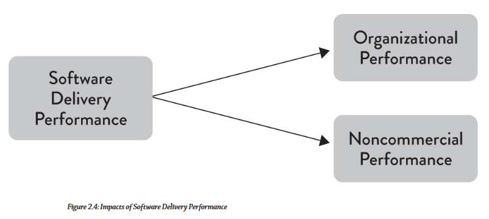
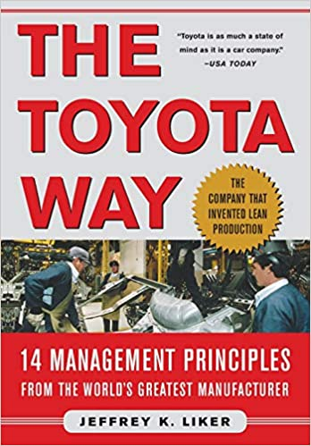

<!-- _class: lead invert -->

# Becoming a high-performance organization
## (and how to stay one)

---

<!-- _class: lead invert -->
<!-- footer: "" -->

# Becoming a high-performance organization

## "The summary \ tips version"

---

## Schedule

1. Definition of high-performance - 5 mins
1. 6 tips for operational performance - 15 mins
1. Q & A - 10mins

---

<!-- _class: lead invert -->

# What is a high performance organization

## And does it really matter?

---

<!-- _class: lead -->
<!-- header: "Definition of high performance"-->
# A high-performance organization

↕↕↕

> A learning organization which relentlessly delivers value to its customers

---
<!-- header: "Definition of high performance"-->
# High-performers vs low performers

- 46 times more frequent code deployments
- 440 times faster lead time from commit to deployment
- 170 times faster mean time to recovery from downtime
- 5 times lower change failure rates

<p style="font-style:italic;color:gray">Accelerate: The Science of Lean Software and DevOps: Building and Scaling High Performing Technology Organizations - 2018</p>

---

<!-- header: "Definition of high performance"-->
# Impact on organizational performance

<p style="text-align:center"></p>

<p style="text-align:left;font-style:italic;color:gray">State of DevOps report 2014</p>

---

<!-- header: "Definition of high performance"-->

<p style="text-align:center"></p>

<p style="font-style:italic;color:gray">Accelerate: The Science of Lean Software and DevOps: Building and Scaling High Performing Technology Organizations - 2018</p>

---

# Our experience:

| | Before | After |
|---|---|---|
| Deployment | 1-2 times per sprint | ~10 times per day |
| Work lead time | 3-4 weeks | 4-5 days |
| deployment lead time | 5 days | ~15 minutes |

---

<!-- header: ""-->
<!-- _class: lead invert -->
# 6 tips to operational performance

---

<!-- header: "Op performance tips"-->
## How-to #1: Avoid Monoliths

- Anything other than a modular monolith is BAD
- Use DDD
- Use Context mapping
- Use EventStorming

<!--
• This includes distributed monolits

• DDD helps you identify Bounded Contexts: domain (think business departments) boundaries and model them in code, encapsulating complexity
• Event Storming builds on top of that and further helps identify contexts and discover business processes
• Context mapping will help you model the integration between BC's

• The above are the only really safe way to do microservices. You may succeed outside of DDD / Event Storming, but you're taking a bet

HELPS: by keeping amount of time needed to introduce changes small by encapsulating changes
-->

---

<p style="text-align:center"></p>

> It is not the domain expert’s knowledge that goes into production, it is the developer’s assumption of that knowledge that goes into production

Alberto Brandolini

---

<!-- header: "Op performance tips"-->
## How-to #2: Avoid persistence ↔ domain model impedence

- Use event-sourcing
- Use your SME's to build your models
- Use Event Storming or Event Modeling

<!--
HELPS: Helps guarantee the information is there when you need it
HELPS: Maintening the solution and adding features to domain is FAR easier
-->

---

<!-- header: "Op performance tips"-->
## How-to #3: Reduce coupling

- Use Event Driven Architecture
- Apply reactive principles
- Prefer choerography...
- ...or share-nothing

<!--
HELPS: Changes do not cascade
HELPS: Adding features keeps taking the same amount of time as time goes by1


-->

---

<!-- header: "Op performance tips"-->
## How-to #4: Reduce build times

- Use onion architecture → domain is dependency-free
- Use quick-feedback tests to validate domain
- Use contract tests to test public data contract versions
- Small number of end-to-end tests

<!--
HELPS: decrease deployment lead time

• OBVIOUSLY: you need rock-solid CI / CD
-->

---

<!-- header: "Op performance tips"-->
## How-to #5: Reduce development-time dependencies

- Bounded Contexts (Event Storming, Context Mapping)
- Structure teams around BC's
- Event Driven Architecture
- More stable service owns the contract

<!--
HELPS: Reduced lead times because one team does not have to wait for another team

• Event driven architectures help reduce development time dependencies due to NO behavioural coupling
-->

---

<!-- header: "Op performance tips"-->
## How-to #6: Reduce rework and waste

- Adopt an improvement budget
- Cross-functional teams
- Swarm / pair (one-piece flow)
- Pull-based system for development (with WIP)
- Carefully consider all alternatives

<!--

HELPS: Time taken in rework or waste, is time which isn't used in delivering value

All of above help with both waste and rework.

-->

---

Reference material:
| Process  | Architecture | People |
|:---:|:---:|:---:|:---:|
|   |      |   |


---
<!-- header: ""-->
<!-- _class: lead invert -->
# Thank you

``` text

```

Savvas Kleanthous
Twitter: <a href="https://twitter.com/skleanthous?ref_src=twsrc%5Etfw" class="twitter-follow-button" data-show-count="false">Follow @skleanthous</a><script async src="https://platform.twitter.com/widgets.js" charset="utf-8"></script>
More to come. Follow me on Twitter for more details.
