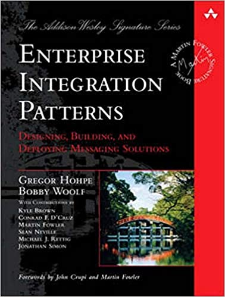

<!-- _class: lead invert -->

# Becoming a high-performance organization
## (and how to stay one)

---

## Schedule

1. Definition of high-performance - 5mins
1. Process - 5mins
1. Architecture - 10mins
1. Q & A - 10mins

---

<!-- _class: lead invert -->

# Definition of high performance

---

<!-- _class: lead -->
<!-- header: "Definition of high performance"-->
# A high-performance organization

↕↕↕

> A learning organization which relentlessly delivers value to its customers

---
<!-- header: "Definition of high performance"-->
# High-performers vs low performers

- 46 times more frequent code deployments
- 440 times faster lead time from commit to deployment
- 170 times faster mean time to recovery from downtime
- 5 times lower change failure rates

<p style="font-style:italic;color:gray">Accelerate: The Science of Lean Software and DevOps: Building and Scaling High Performing Technology Organizations - 2018</p>

---

<!-- header: "Definition of high performance"-->
# Impact on organizational performance

<p style="text-align:center"></p>

<p style="text-align:left;font-style:italic;color:gray">State of DevOps report 2014</p>

---

<!-- header: "Definition of high performance"-->

<p style="text-align:center"></p>

<p style="font-style:italic;color:gray">Accelerate: The Science of Lean Software and DevOps: Building and Scaling High Performing Technology Organizations - 2018</p>

---

# Our experience:

| | Before | After |
|---|---|---|
| Deployment | 1-2 times per sprint | 5-10 times per day |
| Work lead time | 3-4 weeks | 4-5 days |
| Deployment lead time | ~ 1hour | 20 minutes |

---

<!-- header: ""-->
<!-- _class: lead invert -->
# Process

---

<!-- header: "Process"-->
# Drop the waste

- Drop scrum and "Agile" (noun)
- Kanban is not enough
- Go back to principles

<!-- 

• Scrum is bad:
  - Development does not fit neat X week periods
  - Redirects focus from customers to process
  - Zero actual value ceremonies, bandaids over real problems
  - Enforced processes don't work
  - Scrum master role very frequently is abused
• I started with Scrum
• Kanban is a framework for one part of development; good in reducing development waste, but doesn't cover enough of the process

-->

---

<!-- header: "Process"-->
# Baseline

1. Measure everything ↔ Use o11y
1. Split work into sub-day pieces
1. Invest in CI / CD
1. Everything just-in-time:
   - Prioritization
   - Analysis
   - Development
1. Daily retrospective

---

<!-- header: ""-->
<!-- _class: lead invert -->
# Architecture

---

<p style="text-align:center"></p>

> It is not the domain expert’s knowledge that goes into production, it is the developer’s assumption of that knowledge that goes into production

Alberto Brandolini

---
<!-- header: "Architecture"-->
# Start with collaborative modelling

1. Keyword: _collaborative_
1. User story mapping
1. Event storming (big picture → process )
1. Just-in-time:
   - Example mapping
   - Event modelling

---

<!-- header: "Architecture"-->
# Tip 1: Prefer asynchronous communication

- Best fit for internal communication...
- ...when latency isn't a problem
- Use the model
- Prefer choreography

---

# Tip 2: Use the right tool for the job

- Practice polyglot persistence
  - Event sourcing for decisions
  - SQL \ NoSQL otherwise
- Use a proper event store
- Purposely decide on messaging
  - Event store
  - Message bus

---

<!-- header: "Architecture"-->
# Tip 3: Most stable service owns the contract

- If producer is stable, raise events
- If receiver is stable, send commands
- Webhooks behave like synchronous events

---

<!-- header: "Architecture"-->
# Tip 4: Visualize the architecture

- Use C4 system & container diagrams
- Make it be a DAG

---

<!-- header: "Architecture"-->
# Tip 5: Isolate data

- Avoid semantic grouping of data...
- ...only consider use
- Split (or distribute) data on entry in the system

---

Reference material:
| Process  | Architecture | People |
|:---:|:---:|:---:|:---:|
|   |      |   |


---
<!-- header: ""-->
<!-- _class: lead invert -->
# Thank you

``` text

```

Savvas Kleanthous
Twitter: <a href="https://twitter.com/skleanthous?ref_src=twsrc%5Etfw" class="twitter-follow-button" data-show-count="false">Follow @skleanthous</a><script async src="https://platform.twitter.com/widgets.js" charset="utf-8"></script>
More to come. Follow me on Twitter for more details.
