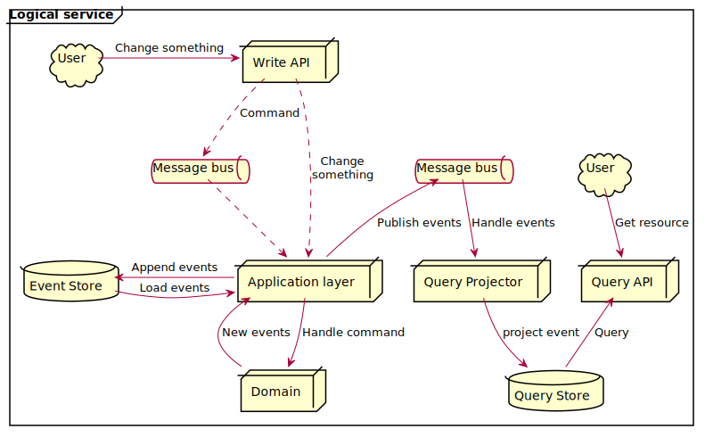

<!-- _class: lead invert -->

# An introduction and Q&A to CQRS and Event Sourcing

---

# Schedule

1. Warmup & process intro - 5 minutes
1. Event Sourcing - 15 minutes
1. Command Query Responsibility Seggregation - 15 minutes
1. FAQ - 15 minutes
1. Open floor Q & A - 45 minutes

---

<!-- _footer: "" -->
<!-- _paginate: false -->


---

<!-- _class: lead invert -->

# Event Sourcing

### What it is and isn't

---

<!-- _header: "Event Sourcing - what it is and isn't" -->

# Event sourcing

- Is just a persistance pattern
- Data stored as a sequence of domain-specific events
- One stream per consistency boundary
- Does introduce eventual consistency across separate streams

<!-- 
Re eventual consistency: This is a difficult thing which may end up being a good thing if used as a heuristic  to re-evaluate your boundaries
-->

----
<!-- _header: "Event Sourcing - what it is and isn't" -->

# Event sourcing - example


----

<!-- _header: "Event Sourcing - what it is and isn't" -->
# Event sourcing

- Is **not** an architectural pattern
- Is **not** an either\or choice
- Is **not** streaming
- Is **not** inherently more complex

<!--

Event sourcing:

- Isn't an architectural pattern, but CERTAINLY is an architectural DECISION
- Isn't an either\or choice: mix and match polyglot persistance patterns
- Streaming is related semantically: events are projected, but misses on key aspects:
  - The emphasis in streaming is processing vs context in ES
  - 👆 causes streaming platforms to optimize for throughput over partitioning for isolation
  - Semantically different
    - Event sourcing focuses on the domain specific things which happen
    - While streaming may be collecting signals, like a stream of current temperature from a sensor, even if temperature didn't change
  - Processing of an event stream _could_ result in a domain event which can be used for ES (along with other uses)
- Isn't inherently complex, but does have a steep learning curve & needs the right environment to work
    
-->

---

<!-- _header: "Event Sourcing - what it is and isn't" -->
# Event sourcing best tips #1

> Modernizing from monolith with single normal form db directly to microservices with event sourcing, without prior experience with microservices and event sourcing, is something that you want to think twice about

<p style="text-align:right;"><br>Savvas Kleanthous<br>2 days ago</p>

---

<!-- _header: "Event Sourcing - what it is and isn't" -->
# Event sourcing best tips #2

- Extract the domain events from domain experts
- Use a proper event store
- Avoid CQRS or DDD frameworks
- Push back on all strong consistency requirements 
  → make them as small as possible

<!--
- Bigger risk is distributed monolith, which is FAR worse than normal monoliths. Where ES comes into play is Often this happens because of dependencies, make sure your workflows have direct access to the data and don't depend on other services. It's not just the runtime concerns 
- It's the domain experts who actually know what's happening. Also:
  - CRUD events _may_ exist, but they should be the very rare exception
  - Using the domain experts to create the events leads too more stable contracts...
  - ... and fewer breaking changes in event versions
- Some things need to be immediately consistent. But not a lot. Pushing back on strong consistency isn't going to make things more complicated & if the business asks for immediate consistency ask what they mean immediately: I once had a situation where "immediately" meant before start of next working day!
- Replay events so that you can be sure the events make sense, and that there are no bugs in data you store. This is especially important if you're just starting on your journey.

- Replay events in write path instead of storing a projection
- Events you use for event stream are local to your service - integration events are separate
- Establish meaningful service boundaries
- Allocate data based on business workflows, _don't_ group by semantics

-->
---

<!-- _class: lead invert -->

# Command Query Responsibility Segregation (CQRS)

### What it is and isn't

---
<!-- _header: "CQRS - what it is and isn't" -->

# CQRS

- Separates domain\business logic from query and view-model generation
- The important bit: the read model and write models are different and can evolve independently
- Often introduces eventual consistency

**Terminology**: Command API and Domain logic parts are often called `write-path`, and the view model generation and query is call `read-path`

---

<!-- _header: "CQRS - what it is and isn't" -->



---
<!-- _header: "CQRS - what it is and isn't" -->

# CQRS

- Does **not** necessitate asynchronous paths
- Is **not** a system architecture (but is service architecture)
- Does **not** need Event Sourcing

----

<!-- _class: lead invert -->

# Frequently Asked Questions

---

<!-- _header: "Frequently Asked Questions" -->
<!-- _class: lead -->
# 1. How do you enforce uniqueness with Event Sourcing?

---
<!-- _header: "Frequently Asked Questions" -->
<!-- _class: lead -->

# 2. How do you handle GDPR with Event Sourcing?

<!--

Some of:

1. Don't distribute information that doesn't need to be distributed. Focus on identifiable information
2. Put all personal / sensitive information only in one place and anonymize later (delete all past events, add a new one with random data and schedule a scavange soon)
3. Crypto-shredding

-->

---

<!-- _header: "Frequently Asked Questions" -->
<!-- _class: lead -->
# 3. When should I use CQRS\ES?

<!--

A must when
- Cost\risk to maintain external audit log is higher than adopting ES
- You have Temporal queries (NOT "simple when was the last change", but "get all actions after X happened", or when you need point-in-time system restore (hey git!))
BUT! for ↑ you _need_ on-demand access to SME's, or at least very regular direct access to them AND design events collaboratively with them

If you have already experience in the team, and access to SME's, Event sourcing is a good default for anything other than generic services.

-->

---
<!-- _header: "Frequently Asked Questions" -->
<!-- _class: lead -->

# 4. Is ES slow?

<!-- 

- In and of itself no, but also:
  - Since it's append-only, it's really amenable to caching.
  - It's quite amenable to clustering given the isolation of data across streams

- _However_: 
  - introduces eventual consistency across aggregates -> other stronger (but still weak) consistency models can be adopted but with increased complexity
  - Some aggregates may have a lot of events. Try:
    - Design that away (smaller boundaries generally will cause fewer changes to be made => fewer events)
    - Snapshot

-->

---

<!-- _class: lead invert -->

# Q & A session

Ask anything you want, but for this session please keep it a beginnerlevel

---


<!-- _footer: "" -->
<!-- _paginate: false -->


---

<!-- _header: ""-->
<!-- _footer: "" -->
<!-- _paginate: false -->
<!-- _class: lead invert -->
# Thank you

``` text

```
Savvas Kleanthous

You can find this (and other) presentations here: https://skleanthous.github.io/presentations/

Twitter: <a href="https://twitter.com/skleanthous?ref_src=twsrc%5Etfw" class="twitter-follow-button" data-show-count="false">Follow @skleanthous</a><script async src="https://platform.twitter.com/widgets.js" charset="utf-8"></script>
