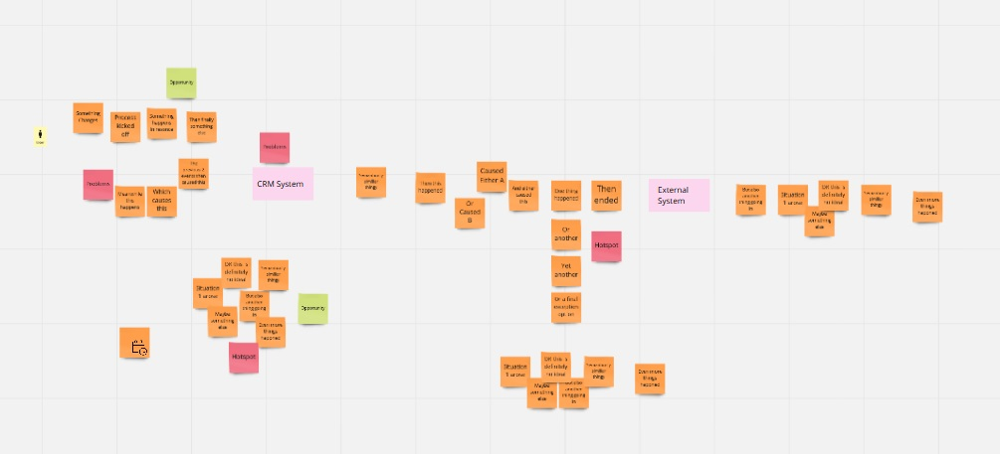
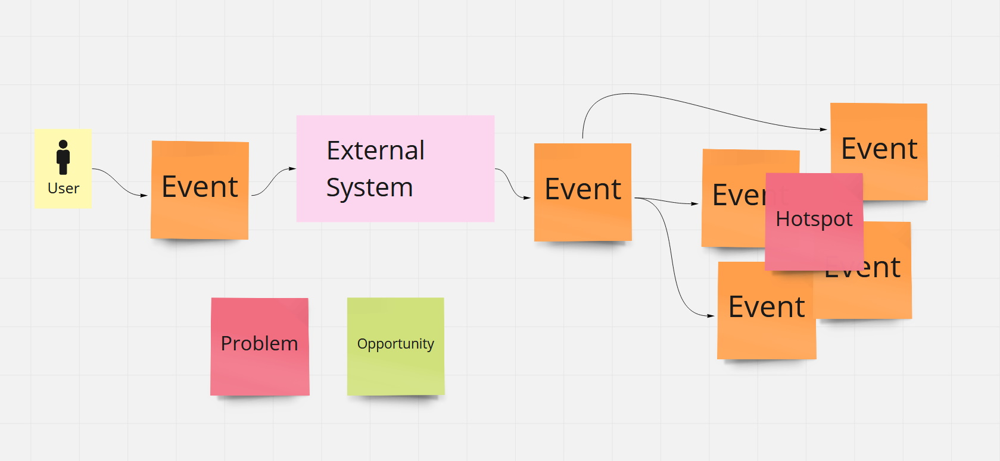
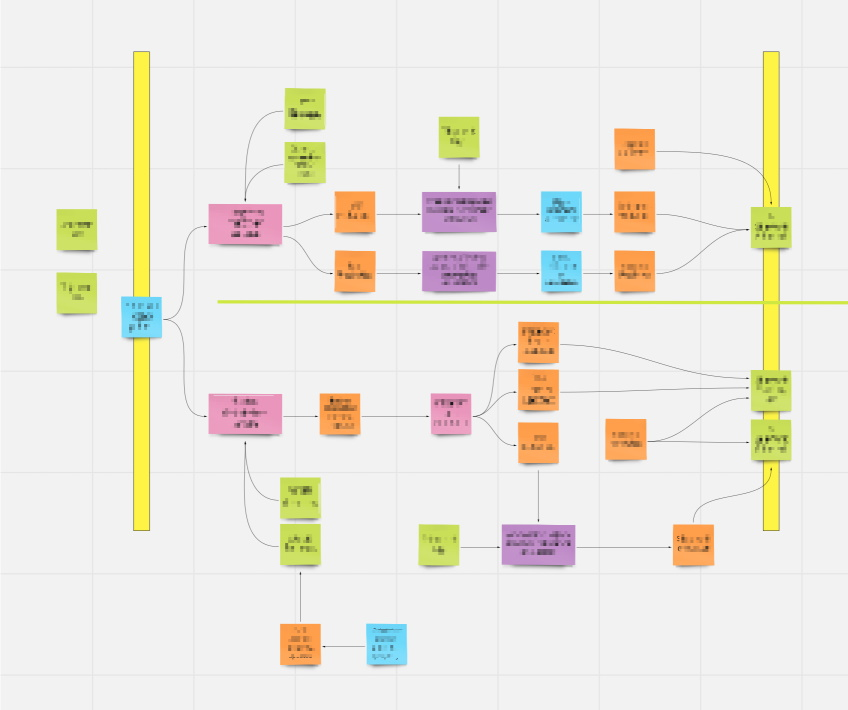
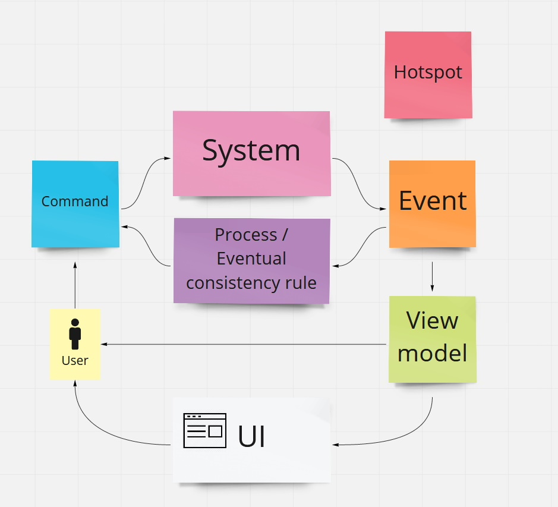
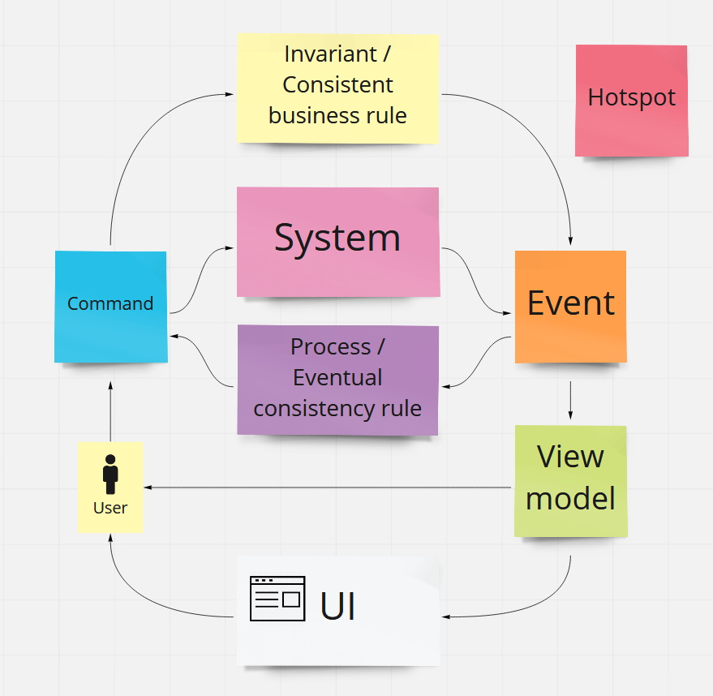

<!-- _class: lead invert -->

# Event Storming

_Building the right thing_

---

## Schedule

1. Why event storming? - 5 min
1. Big picture - 10 mins
1. Process level - 10 mins
1. Design-level - 5 mins

---

<!-- _class: lead invert -->

# Why event storming?

---

# What is it?

- Highly collaborative modelling session
- Focusing on the events of a system
- Immensely powerful

---

# What makes it useful?

- Discussions!
- Focusing on events is natural
- Shared understanding
- Easy to experiment and refactor

---

# Why not something else?

Event modelling comes close, but lacks on brainstorming aspect

Mainly lacking:

- Brainstorming
- Ease of refactoring
- Different scopes
- Ability to involve SME's

---

<!-- _class: lead invert -->

# Big picture event storming

---

<!-- _class: lead invert -->
<!-- _footer: "" -->


---

# What is it?

- An exploration of the problem space
- Focus on discussion!
- Shared understanding

---

# Who participates in it?

**_Everyone_**

- Founders
- Subject matter experts
- Analysts
- Product team
- Users!

---

<!-- _class: lead invert -->
<!-- _footer: "" -->


---

<!-- _class: lead invert -->

# Process level event storming

---

# What is it?

- Collaborative workshop to model processes
- Narrower scope than big picture - "zoomed" in
- Clear boundaries defined

---

# Who participates in it?

- Product team
- Business Analysts
- Subject matter experts

---

<!-- _class: lead -->
# How does process-level event storming look like?

---

<!-- _class: lead invert-->
<!-- _footer: "" -->



---

<!-- _footer: "" -->
<!-- _class: lead invert -->



---
<!-- _footer: "" -->
<!-- _class: lead invert -->



---

<!-- _class: lead invert -->

# Software design event storming

---

# What is it and who participates?

- Collaborative workshop to agree on software design
- Entire product team participates: 
  - SME's
  - PO's
  - UX
  - dev team

---

<!-- _footer: "" -->
<!-- _class: lead -->
# Legend
---

<!-- _footer: "" -->
<!-- _class: lead invert -->


---
<!-- header: "" -->
<!-- _class: lead invert -->
<!-- _footer: "" -->
# Thank you

``` text

```

Savvas Kleanthous

You can find this presentation here: https://skleanthous.github.io/presentations/

Twitter: <a href="https://twitter.com/skleanthous?ref_src=twsrc%5Etfw" class="twitter-follow-button" data-show-count="false">Follow @skleanthous</a><script async src="https://platform.twitter.com/widgets.js" charset="utf-8"></script>
More to come. Follow me on Twitter for more details.
