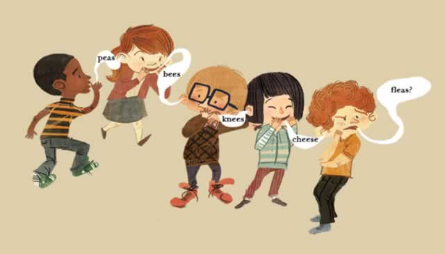
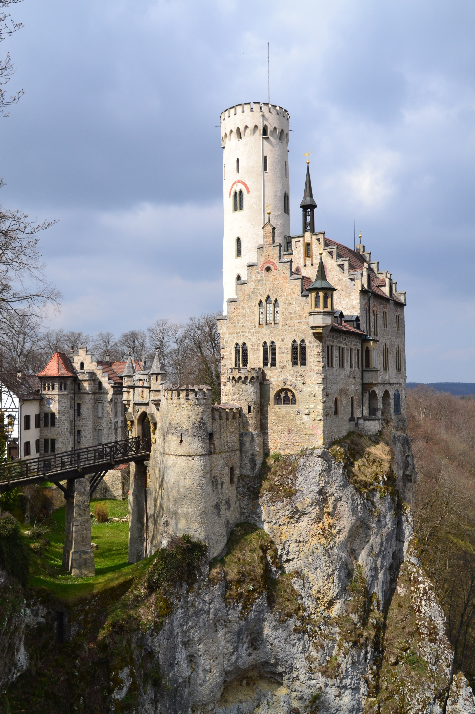

<!-- _class: lead invert -->

# Event Storming

_Building the right thing_

---

## Schedule

1. Why event storming? - 5 min
1. Big picture - 10 mins
1. Process level - 10 mins
1. Design-level - 5 mins

---

<!-- _class: lead invert -->
<!-- _footer: "" -->


<style scoped>
h1,h2,h3 {
  text-shadow: 0 0 3px #000000, 0 0 5px #0000FF;
}
</style>


# But first a story:

## experiences from my career

---

<!-- _footer: "" -->


<!-- 

As a junior problem 1:

PM required features done
PM told BA's
BA's spoke to SME's to get requirements
BA's analysed requirements
BA's spoke to architects
Architects did their thing
Requirements + architecture were pushed to dev team

-->

---

<!-- _footer: ""-->


<!-- 
Outcome: Missed deadlines, wrong functionality delivered, many bugs, unhappy customers.
-->

---

<!-- _footer: "" -->


<!-- 

Later in life:

BA was part of the team
But architecture was external
Discoveries did not change design or approach


Better than before, but more missed deadlines, overtime, again unhappy customers, bugs
-->

---

<!-- _footer: ""-->


---

<!-- _footer: "" -->


<!-- 

Later in life:

Agile won, but as a knee-jerk reaction to big-up-front planning
it seems as if the world rejected entirely the notion of up front
design. We lost conceptual integrity entirely.

Decisions were only locally optimized, and the network effect of
communication across departments exploded.

Dependencies from other departments started becoming show-stoppers.

-->

---

<!-- _footer: ""-->


<!-- 

Awesome? Nope.

-->

---

<!-- _footer: ""-->


<!-- 

Yes, you guessed it, better than before, but still problematic:

+ Feedback now exists and is considered
- No real communication across departments
- No visibility of what other teams are doing
- Localized decisions need to be repeated in other teams
- Loss of conceptual integrity: different parts implement different patterns, or behave slightly different. It feels like a disjointed bundle of pieces

-->

---

<!-- _class: lead invert -->

# Why event storming?

---

# It fixes _everything_! (almost)

- No more silos
- Everyone has a voice
- Clarity on what's going on
- Shared understanding

---

# What is it?

- Highly collaborative modelling session
- Focusing on the events of a system
- Immensely powerful

---

# What makes it useful?

- Discussions!
- Focusing on events is natural
- Shared understanding
- Easy to experiment and refactor

---

# Why not something else?

Others mainly lacking:

- Brainstorming
- Ease of refactoring
- Different scopes
- Ability to involve SME's
- Gated access to information

---

<!-- _class: lead invert -->

# Big picture event storming

---

<!-- _class: lead invert -->
<!-- _footer: "" -->


---

# What is it?

- An exploration of the problem space
- Focus on discussion!
- Shared understanding

#### →Importantly, it solves most of the problems I mentioned in my introduction

---

# Who participates in it?

- Founders
- Subject matter experts
- Analysts
- Product team
- Users!

---

<!-- _class: lead invert -->
<!-- _footer: "" -->


---

<!-- _class: lead invert -->

# Process level event storming

---

<!-- _class: lead invert-->
<!-- _footer: "" -->


---

# What is it?

- Collaborative workshop to model processes
- Narrower scope than big picture \ "zoomed" in
- Clear boundaries defined
- Often the right level to drive development

---

# Who participates in it?

- Product team
- Business Analysts
- Subject matter experts

---

<!-- _footer: "" -->
<!-- _class: lead invert -->


---

<!-- _class: lead invert -->

# Software design event storming

---

# What is it and who participates?

- Collaborative workshop to agree on software design
- Entire product team participates: 
  - SME's
  - PO's
  - UX
  - dev team

---

<!-- _footer: "" -->
<!-- _class: lead invert -->


---
<!-- header: "" -->
<!-- _class: lead invert -->
<!-- _footer: "" -->
# Thank you

``` text

```

Savvas Kleanthous

You can find this presentation here: https://skleanthous.github.io/presentations/

Twitter: <a href="https://twitter.com/skleanthous?ref_src=twsrc%5Etfw" class="twitter-follow-button" data-show-count="false">Follow @skleanthous</a><script async src="https://platform.twitter.com/widgets.js" charset="utf-8"></script>
More to come. Follow me on Twitter for more details.
