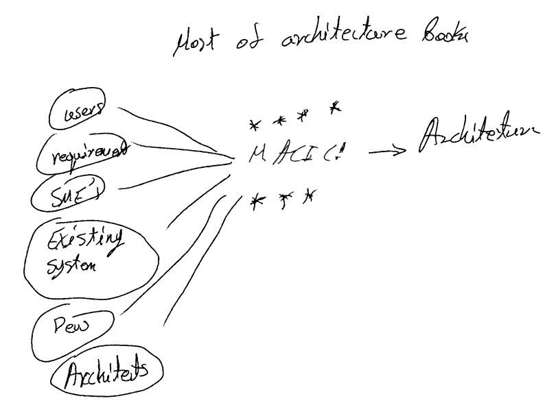
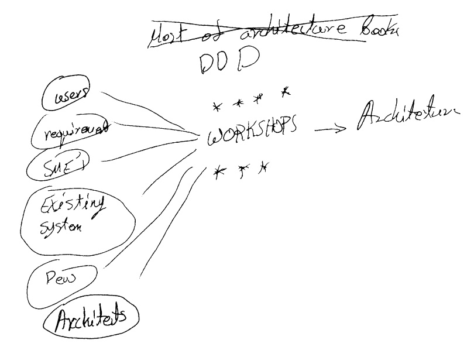

<!-- _class: lead invert -->
<!-- _footer: "" -->
<!-- _paginate: false -->

# System decomposition: a how-to
## Or: tearing it down and building it up again

---

<!-- _class: lead invert -->
<!-- _footer: "" -->
<!-- _paginate: false -->

# THIS IS A WORK IN PROGRESS

(and a work of love and many years of tears and pain)

---

# Schedule

1. Tear down software architecture to it's basics
1. Building a theory
1. Building a process

---

<!-- _class: lead invert -->
<!-- _footer: "" -->
<!-- _paginate: false -->

# Section 1: Tearing it all down

---

# Software architecture - a small rant

- No _practical_ guidelines!
- Architectural decisions are hard to change:

<!--
1. Anyway... Problems:
  - Loooot's of theory
  - Lot's of advice on what _not_ to do
  - Some advice on how to gather info
  - Info about patterns (PoEA)
  - Info on effect of good arch and bad arch, but no info how to get there
  - Some info on what "good arch" looks like, but VEEERY context specific, without defining the context. ARGHH!!

1. I don't teach my children by telling them what NOT to do! I wouldn't have a house by now. Why is architecture like that now?? I don't want to bankrupt a few companies before I learn!!

1. Above combine with the fact that arch decisions are hard to change to create a nightmare scenario.

-->

---

<!-- _class: lead -->

## "Architecture represents the significant design decisions that shape a system, where significant is measured by cost of change."

 Grady Booch 

---
# The reductionist view of architecture

- Coupling *
- Complexity

*: Multiple types and it includes teams, SME's, processes, external systems etc.

<!--

It took me years to get here

I spostulate that all other factors and effects are an outcome of these two things applying at different levels and parts of the system.

I'd love to hear challenges to this, as this is my basic premise.

As an example, feedback in systems thinking is an outcome of system behaviour (inherent) and coupling. Complexity also effects feedback a bit, but more indirectly to coupling.

Another example is connacense (a measure indicating that if one thing changes then another thing has to change and vice versa). In my model this is just one form of coupling.
-->

---

# A system thinkers perspective

<!--
Feedback loops are how systems interact. Systems on all levels simultaneously.
-->

---

<!-- _class: lead -->
# What system are you talking about???

## _EVERYTHING_

(code, functions, services, subsystems, users, developers, business, economy, _everything_)
<!--

- Classes \ Functions \ components
- Services
- Sub-systems
- Software systems and external systems
- Users
- Developers
- Business people and SME's
- And competitors!

A small side-note: Feedback loops really define the behaviour of a system.

I am NOT sure about this, but I believe that complexity manifests on system level as another form of feedback on another level than the system exhibiting the complexity.

Think of the system that has the complexity that has users. Let's think of a warehouse system. It works and it has users. Complexity manifests in two types of feedback:
- Complexity in usage scenarios: users bypass parts of it and do stuff in different ways, or stuff just take longer to do. This is feedback to owners of goods being stored and shipped and restocked in form of problems.
- Complexity in software itself: making changes takes very long. This is a feedback loop of a system involving the developers)

Sociotechnical systems are called that because it involves the people using them _and_ the people maintaining \ working on those systems.

And it doesn't stop there. There are competitors to think of that are another form of feedback loops.

I can probably spend a whole day discussing this alone, but let's just say that go too deep and your mind may be blown.

-->

---

# Systems thinking

- Feedback loops
- System patterns \ observations??

<!--
ARGH!

Again, very useful stuff, but not practical, not positive actions.

-->
---

# Why is architecture hard?

- Hard to change :) 
- Difficult to visualise everything
- Difficult to know which aspects are important
- Feedback loops on architecture can be really slow

<!-- 
My opinion: A huge contributing factor to the above is that software engineering arose as a means to automate other stuff and not as an engineering principle in its own right. There was a push towards more and more software as the value of automation became more and more evident, with little to no time to do any scientific research behind it. Even to this day it's a half-baked field of engineering, with a lot of people claiming you can't be a software _engineer_, and I can't fault them (even if I disagree) because research has still not caught up
-->

---
<!-- _footer: "" -->

---

<!-- _footer: "" -->

---
<!-- _class: lead -->

I'm only half joking

<!-- 

I believe the above, but I want to emphasize that there is tremendous value in the existing knowledge base. That's how we (humans) are meant to learn: building on top of knowledge of others.

-->

---

<!-- _class: lead -->
<!-- _footer: "" -->
<!-- _paginate: false -->

> ## Can someone _please_ point me to some hands-on guidelines to build an architecture??

Me, some years ago.

---

<!-- _class: lead invert -->
<!-- _footer: "" -->
<!-- _paginate: false -->

# Section two: building it up again

---

<!-- _class: lead -->
<!-- _footer: "" -->
<!-- _paginate: false -->

# There are some maths involved

## Bare with me please...

I hope it will help at the end

---

# Basic premise

- Coupling and complexity are adequate and enough
- Given we consider these at all subsystems and systems 

---

# Basic premise: useful

Let's take gravity:

- F = m*g is not true
- F = G * (m1 * m2) / (r^2) also not true
- Spacetime curvature is where we are now

<!--
Wrong theories may have value

Similarly, I don't believe what I have here is perfect, but I hope it's useful. And I'll explain.
-->

---

# Useful scientific theory exists!

- Control Theory \ Feedback controlled systems

<!-- 
Control theory is certainly related to what I do here. However, to tie things up is a lot of work. I mention it as it may make some things clearer in case you are aware of this, and I am more than happy to get contributions from people if this sparks something.
-->

---

# Coupling:

- (Re-)Defined as an abstract measure of "togetherness" of two or more "things"
- Teams, companies, processes may be coupled too!

<!-- 
NOTE:
- There are different types of coupling
- VERY important: we have lots of control on coupling

- Put differently: A is coupled to B, if A influences B. The reverse may not be true.
- We can control it quite a lot. Not it's existence, but whether it affects onw system and not the other. For example we can't control that A will be coupled to B, but we can control the direction. We can also control whether they are not directly coupled, but indirectly coupled to a more stable thing
-->

---

# Complexity

- (Re-)Defined as an abstract measure of how easy it is to understand, use, and\or think about some part of a system or process

<!--
- _Generally_ speaking we can manage it using encapsulation and information hiding

- We can control some of it, but there is inherent complexity
-->

---

### Interlude: Are coupling and complexity dependant variables?

- No... to an adequate degree

| | |
|---|---|
| A very tightly coupled system may be easy to understand | A highly uncoupled system can be very difficult to understand|

<!--

NOTE: they are not entirely independent! However, the relationship is such that allows use of automatic control theory

Actually, forcefully lowering coupling can enforce a minimum complexity on a system. It doesn't mean we can calculate complexity from coupling though, so we're safe to continue and assume they're orthogonal for the purposes of the following.
-->

---

# Extreme examples

| | |
|---|---|
| A single method doing everything | "No microservice can have more than 100 loc"|
| | Simple services with low complexity all sharing the same data model |

<!--

 - Single method: no coupling (is one thing)but has insane local complexity
 - (almost certainly) insane amounts of coupling, high global complexity, super-small local complexity
-->

---

# Is there a perfect architecture?

- Not perfect, but a "best" given a situation

- It's the one which results in the smallest cost to build, maintain and use

---

# Mini-rant (again)

Systems are living things. They get born, evolve and die.

<!--
In a theoretical world, the best architecture would only require us to think of complexity.

with the effort being a linear relationship to the size of the system (which would be a _relatively_ fixed cost on top of any complexity to understand)

--> 

---
<!-- _footer: "" -->

# Factor 1: Coupling

$$ LCoupC(α) =\sum_{β=β1}^{B} \int_{0}^\infty A × C(αβ, t) × RoC(β, t) dt$$

- LCoupC(α): Lifetime Coupling Cost of component α
- B: the set of all compoenents α is coupled to
- C(αβ, t): Coupling of component α to component β (directional)
- RoC(β, t): Rate of change of component β

<!--
- A is the cost to make code changes to component α
- Here volatility becomes important, because:
  1. We are in more control of coupling than complexity. We can get coupling down to zero for example
  1. The cost is proportional to the change of all dependent components (which can be exponential)
-->

---

# Let's consider the above for a minute

- Generic BC
- Services coupled to a Core BC

<!--
- A coupled mess that never changes doesn't have a lifetime cost other than the fixed to build it once
- Something that is FULLY decoupled has zero cost due to coupling
- Something that is very coupled will have a high lifetime cost
-->
---

# Factor 2: Complexity

$$ LComplC(α) = \int_{0}^\infty C × Compl(α, t) × RoC(α, t) dt$$

- LComplC(α): Lifetime Complexity Cost of component α
- Compl(α, t): Complexity of component α
- RoC(α, t): Rate of change of component α

<!--

The minimum of complexity is inherent complexity + complexity due to coupling \ dependencies
-->

---

## Let's consider this a bit

- Complex subsystem \ Supportive BC
- Core BC

<!--
- Complexity is only internal to the component
- Complexity is _far_ less dependent on rate of change of system
- Coupling is directly proportional to a sum of rate of change

I will not postulate that this is more or less important. I just find it interesting
-->

---

<!-- _footer: "" -->

# Total cost of change = sum of above two costs for all parts of the system

$$ TCoA =\sum_{α=α1}^{Α} ( LCoupC(α) + LComplC(α))$$

- A: the set of all components our system is made up of.

**NOTE**: The above is the set of components at all levels and aspects of the system. Changing an administrator has costs as much as changing a piece of code, and they work the same way! 🤯

<!-- 
  VERY important to note that this applies to all levels
-->

---

# The best architecture?

The one that minimizes TCoA across the lifetime of the application (not just temporarilly)

Mathematically speaking we need to solve $d(TCoA)/dt = 0$ and find the global minimum

---

<!-- _class: lead -->
<!-- _footer: "" -->

# Still with me?

(thank you)

---
<!-- _class: lead -->
<!-- _footer: "" -->
<!-- _paginate: false -->

# Your rant (probably):
## "Weren't you the one ranting about too much theory not enough practical advice?"

---

<!-- _class: lead invert -->
<!-- _footer: "" -->
<!-- _paginate: false -->

# Part 3: Building a process \ framework

---

# What's next?

- Now we have a way to evaluate
- We know what are the physics of our world

---

# The summary

1. Build a detailed view of the system with it's working parts
1. Discover rate of change of parts of the system
1. Discover inherent togetherness of parts of the system
1. Encapsulate things that change together
1. Group larger parts that make consistent changes on the same entities

---

# Step 1: Start with a big picture

- Visualize the system and how it works. The "Big picture"
- Visualize value and competitive advantage
- Visualize or discover industry trends
- Visualize user journeys
- Visualize systemic dependencies

<!--
- I use big picture event storming to begin with, but anything will work for this as long as you can visualize actions happening, and systemic dependencies
- Wardley mapping for value and industry trends
- User story mapping

Strategic DDD is here
-->

---

# Step 2: Model all workflows

- Clearly model all workflows
  - _Maybe_ not simple cruddy ones, but use caution
- Clearly flag external dependencies
- Discover and flag repeated processes or process steps

<!-- Strategic DDD is here too-->
---

# Step 3: Model workflow implementation

- Model implementation
- Clearly flag repeated steps
  - Discover repetitions _across_ implementations
- Indicate usage of data:
  - Indicate need for consistent changes
  - Indicate acceptance of staleness

<!-- Tactical DDD is here -->

---

# Step 4: Draw your first boundaries

1. Use all big-picture info to discover slow-changing subsystems, and replace them with "dependencies"
1. Reflect those on your workflows (removing internal workflow steps)
1. Group workflow steps that are re-used across workflows into "dependencies"

## These are your first services \ libraries :)

<!-- 
Slow changing subsystems are:
- Generic functionality (notifications, payments if these are not your value proposition \ competitive advantage)
- Stuff that are or will be commodity for you (infra)

NOTE: These do not need to be different executables \ services. They just need to be encapsulated so that we can decrease complexity by reducing cognitive load \ using information hiding
-->

---

# Step 5: Group workflows

1. Workflows that make consistent changes to something should be grouped together

<!--
Point 1: is about correctness. It is important to make sure you make consistent changes _only when you really need it_. Having said that if you need consistent changes and you decouple it, this will introduce accidental complexity.

-->
---
# Step 6: Discover platform concerns

1. Indicate repeated implementation steps on workflows
1. When those implementation steps are re-used across workflows that aren't grouped, group these steps in a "dependency"
1. These are (probably) your platform concerns

<!--
I call these platform concerns, but they may not be infrastructure related. These can be stuff like authorization, authentication, logging etc. BUT they can also be repeated patterns you want to encapsulate for sake of conceptual integrity
-->

---

# Step 7: Use a big picture of all the above to draw boundaries

1. Our goal is to encapsulate the remaining things on our "everything" model where complexity within the boundary is balanced with dependencies and coupling on the level above
1. Repeat step 1 if needed on a layer above

---

# Step 7 (cont.)

- This is an NP complete problem
- In theory, we can feed the model into something that can discover (at least local) optimums

--- 

# Bonus tool: controlling coupling

1. In the above steps, we accepted coupling in the direction of data flow.
1. We can do better
1. Use commands, events, synchronous and asynchronous communication to control the direction and "hardness" of coupling

---

<!-- _class: lead -->
<!-- _footer: "" -->
<!-- _paginate: false -->

# Why the math?

---
<!-- _footer: "" -->
<!-- _paginate: false -->

| Rule | Why |
|---|---|
| Slow changing subsystems | Minimize complexity without affecting coupling cost|
| Platform concerns | Minimize complexity without affecting coupling cost |
| Considering all components at all levels | Don't ignore effects of hidden coupling |
| Grouping around consistency boundaries | Minimize very strong coupling - C(αβ) |
| Isolate workflows | Minimize complexity - without affecting coupling |

---

<!-- _class: lead invert -->
<!-- _footer: "" -->
<!-- _paginate: false -->

# Thank you

## Savvas Kleanthous (@skleanthous)