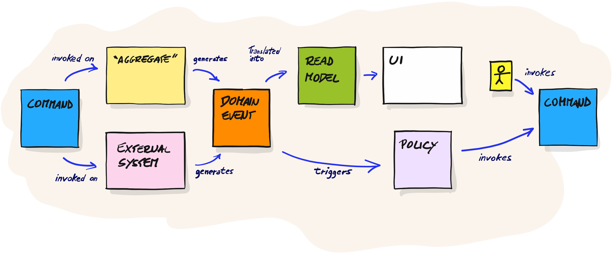

<!-- _class: lead invert -->

# Design Level Event Storming
## 4-hour workshop

---

## Schedule

1. Overview of Event Storming - 10 minutes
1. Design level - 50 minutes
1. Lending domain - 30 minutes
1. 60-minute workshop
1. 60-minute workshop
1. Wrap-up and Q&A - 20 minutes

---

<!-- _class: lead invert -->

# ‼ Walls of text warning ‼

I wanted you to be able to refer back to this. It's not a normal presentation. Please don't take notes, this is publicly available. Think of it as a blog post in presentation format.

---

<!-- _class: lead invert -->

# Overview of event storming

---

## Big-picture event storming - 1

- It is an exploration of a company, across it's domains and subdomains
- Focusing on the events that drive the business
- **NOT** only software
- Psychological safety is key to success
- Doesn't work well in virtual space :( 

---

## Big-picture event storming - 2

- Highly collaborative
- Everyone understands what the business does
- Everyone understands what other people do...
- ...and how
- Amazing way to discover issues...
- ...and discuss opportunities
- Most importantly: discussions happen
- Also, a _big_ heuristic for domain and sub-domain boundaries

---

## Process-level event storming - 1

- Demonstrated _how_ things get done
- Again through a focus on the events...
- ...plus commands and policies (and data)

---

## Process-level event storming - 2

- A great way to view workflows and processes
- An amazing way to discover important policies
- Very collaborative
- Easier to demonstrate problems where they happen
- Great way for a _product-delivery team_ (or stream-aligned team) to agree on what to build 

** product-delivery team: combination of product, domain experts, developers, testers, etc working together on a customer facing work

---

## Why event storming and not something else?

- It's not an either\or choice...
- It _can_ work _very_ quickly
- Can provide immense value

---

## Why _not_ event storming?

- Needs active participation
- Needs buy-in
- Needs psychological safety (to ask uncomfortable questions)
- Doesn't work for all teams, but it's dependent on the people, not the context

---

<!-- _class: lead invert -->

# Design-level event storming 

---

## Why do we use it?

- Focuses on the dynamic view (workflows)
- Team agrees and confirms:
  - Allocation of responsibilities
  - Transactional boundaries \ aggregates
  - Domain services
  - Important entities
  - Behaviour to implement
- Discover missed functionality and discuss it

---

## What Design level does _not_ do:

1. Doesn't document algorithmic decisions
1. Doesn't work well for structural analysis
   1. Although complex static structures \ hierarchy is best avoided in most case

---

## Specifically about allocation of responsibilities

‼ Avoiding structural and semantic allocation of responsibilities helps avoid "god" classes and reduces rate of change and duration for rework ‼

Design level allows us to design by focusing on dynamic view, avoiding this

---

## Grammar

---

## Design level has two phases:

➭ The "linear" phase
➭ The "boundary-setting" phase

---

## Phase 1: The linear phase

* we model the system in a linear manner
* _Very_ similar to process level
* We focus on the sequence of decisions we need to make...
* ...but add the info we need to decide consistency boundaries

---

## The linear phase step-through - 1

1. Take a process and copy its anchor points
1. Add events, considering code-level decisions
1. Add systems in this step and users
1. Do a narrative walkthrough to confirm your model can support the process

---

## The linear phase step-through - 2

1. Add commands
1. Add policies between events and commands
1. Add the minimal amount of consistency you need between commands and events using an aggregate sticky. Add read models
1. Use a policy sticky with the same name across different places for a process manager
1. Repeat for all processes you own or all processes affected by the new requirement \ request for change

---

## Tips

⭐ For what fits in an orange sticky, think about unit tests. We want to discover units of behaviour. An orange sticky should be the decision of one method of domain logic (and maybe some helpers)
⭐ Don't get stuck on validations, but don't ignore them either. If you discover you're discussing invariants, represent these with a transactional boundary
⭐ Make a point to discover policies between events and commands
⭐ Don't be _too_ strict about grammar. Use it as a heuristic, not a law

---

## Tips #2

⭐ Hide stuff you don't want to discuss (a library, another service that you don't want to touch) behind a system sticky. Do this when you're discussing a new feature and you don't want to make big changes
⭐ When you want to confirm your boundaries, _do **NOT**_ hide behaviour you own behind a systems sticky. Do this from time to time.
⭐ Name your policies by the rule they apply ("Always do X when Y", "We don't accept Z combination because of ABC reasons" etc)

---

## Tips #3

⭐ If you find you need something special because it's important to you, don't be afraid to add it (like a PM sticky). Do make a consious effort to avoid this however, and only add these if it helps unblock discussions
⭐ Long names are fine. Now it's good to be descriptive
⭐ Add hotpots for problems you're discovering, but try to resolve them before finishing the linear phase if possible
⭐ It's fine to branch. Use vertical space liberally
 
---

## What good phase 1 looks like?

➭ It answers yes to the following questions:

♥ Does one event correspond to one XUnit unit test or feature?
♥ Is the data in aggregate stickies _really_ the minimum amount of data required to guarantee the decision can be made? (ignoring data in command)
♥ Is the data in aggregate _really_ the minimum amount of data where we need to enforce immediate consistency?
♥ Policies apply one "rule"

---

## Phase 2: Boundary setting

* We discover and agree on boundaries \ aggregates
* Allows for collaborative exploration of boundaries
* It's very important, and very valuable
  * The biggest failures in software I've seen (outside of architectural-level bad decisions) is about allocating responsibilities to units of behaviour

---

## Boundary setting Step-through #1

1. Draw arrows from and to policies
1. If you're sure stale data are accepted remove the yellow sticky and replace it with a read model
1. Command-System-Event stickies are your ACL layer showing through...
1. Group Command-Aggregate-Event stickies together into "behaviour groups"
1. Group Command-Event tuples without system into "domain services"

---

## Boundary setting step-through #2

1. Move behaviour groups with same aggregate very close
1. Add workflows to source data you don't get from commands. You may need to go back to phase 1 for this
1. Decide if you want to move policies into aggregates OR have them standalone
1. Experiment moving your behaviour groups, domain services and policies until you're happy with the coupling and cognitive load your decision represents

---

## Tips #1

⭐ Domain services can live in a boundary of their own or within an aggregate
⭐ Stateless policies are great!
⭐ Prefer using stale data when possible. This allows you to move your domain service anywhere, so as to reduce coupling. Very useful to remove coupling between the source of the data and the logic that needs that data as input. Experiment!

---

## What good phase 2 looks like

♥ Small aggregates
♥ Good balance of aggregate size and dependencies between aggregates
♥ Small number of dependencies between boundaries

---

<!-- _class: lead invert -->

# Intro to domain

---

## Domain: Lending company

1. Lending startup
1. Focus on VERY low risk loans:
   1. Get info by partnering with employers
   1. Amazing underwriting capabilities
   1. Use salary sacrifice

---

## Why this domain?

- No biases from previous experience
- Savvas have **tons** of experience on this
- Lots of similarities to PVR situation:
  - Very server-side heavy
  - Lots of policies
  - Long-running processes
- Many decisions with trade-offs

---

## The context

- People apply for a loan and provide their employment details
- The company gets paid by employer directly OR by DD from borrower
- Very thorough underwriting process unless the borrower has perfect credit history
- To reduce the exposure from funders, the lending company calculates repayments so that interest is repayed first
- The company needs to show a _clear_, consistent audit log of repayments, late payments and underwriting data and decisions

---

<!-- _class: lead -->
## For this (too small) workshop, we'll focus _only_ on one small part of the domain 👇

## Acquisition and repayments

---

<!-- _class: lead -->

## [Go to miro for walkthrough](https://miro.com/app/board/uXjVPnJWBxg=/?share_link_id=545248616395)

---

<!-- _class: lead invert -->

## Hands-on time

---

## Hands on

1. Split into groups of 3-5 people
1. We'll do two 1-hour sessions
   1. Try to finish phase 1 before the middle of the second session, ideally during the first 1-hour session
1. Follow the rules above for design level
1. Contact me if you have any questions, either on slack or Zoom

---

<!-- _class: lead invert -->

## Wrap up - Q&A

